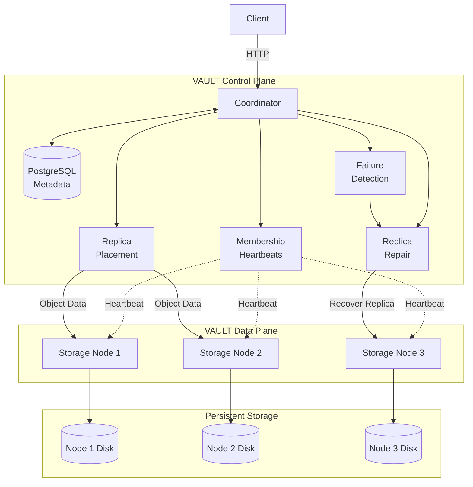

# VAULT — Distributed Object Storage Network

VAULT is a distributed object storage system designed to provide a **single logical storage layer over multiple independent storage nodes**.

Applications interact with VAULT as one storage service. VAULT manages the underlying storage topology, object placement, replication, node health, failure recovery, and data movement.

The core lifecycle is:

> **Store → Replicate → Detect Failure → Repair → Serve**

The long-term goal is to allow independent machines to join the cluster and contribute local storage capacity without requiring applications to know which physical node stores an object.

---

## 1. Vision

A client should not need to know:

* Which storage node contains an object
* Where replicas are located
* Which node failed
* Where a repaired replica is created
* When data is moved during cluster changes

Instead, the client interacts with a stable object-storage API while VAULT manages the distributed system underneath.

```text
                    Application
                         │
                         ▼
                  ┌──────────────┐
                  │     VAULT    │
                  │ Object Store │
                  └──────┬───────┘
                         │
              ┌──────────┼──────────┐
              ▼          ▼          ▼
           Node A      Node B      Node C
              │          │          │
              ▼          ▼          ▼
           Storage    Storage    Storage
```

---

# 2. High-Level Architecture

VAULT is divided into a **control plane** and a **data plane**.



The diagram intentionally stays at a high level. Individual implementation details such as workers, queues, retry mechanisms, and reconciliation processes are described in the relevant sections rather than cluttering the primary architecture.

---

# 3. Control Plane

The control plane manages the **state and decisions** of the distributed storage system.

Its responsibilities include:

* Node registration
* Membership tracking
* Heartbeats
* Node health
* Object metadata
* Replica placement
* Replica state
* Failure detection
* Repair coordination
* Reconciliation
* Cluster changes
* Data movement

The control plane should coordinate storage operations without becoming the permanent transport path for large object payloads.

### Coordinator

The coordinator is the primary control-plane entry point.

It is responsible for:

* Receiving object-storage requests
* Looking up object metadata
* Selecting storage nodes
* Coordinating replication
* Tracking replica state
* Detecting replication deficits
* Triggering repair
* Managing node membership
* Coordinating cluster changes

A logical responsibility does **not** automatically require a separate deployable microservice.

VAULT should create service boundaries only when they provide a real operational or architectural benefit.

### PostgreSQL

PostgreSQL stores control-plane metadata such as:

* Object metadata
* Object keys
* Internal object IDs
* Object size
* Checksums
* Replication factor
* Replica locations
* Replica states
* Storage-node metadata
* Node health
* Timestamps
* Cluster state required for coordination

PostgreSQL does **not** store the actual object bytes.

---

# 4. Data Plane

The data plane is responsible for the actual object data.

Storage nodes handle:

* Object writes
* Object reads
* Object deletion
* Local disk persistence
* Checksum verification
* Replica transfers
* Repaired replicas
* Local storage management

The physical bytes belong to the storage nodes, not the coordinator.

This separation keeps the coordinator focused on distributed-system decisions instead of turning it into a large-object data proxy.

---

# 5. Data Ownership

VAULT follows explicit data ownership.

```text
                    VAULT

             ┌───────────────────┐
             │   Control Plane   │
             │                   │
             │ PostgreSQL        │
             │ Metadata          │
             └─────────┬─────────┘
                       │
                       │ placement
                       │ replica state
                       ▼
             ┌───────────────────┐
             │    Data Plane     │
             │                   │
             │ Storage Nodes     │
             │ Object Bytes      │
             └───────────────────┘
```

### PostgreSQL owns

```text
Object metadata
Node metadata
Replica metadata
Cluster state
```

### Storage nodes own

```text
Object bytes
Local persistence
Local checksum validation
Replica transfer data
```

Services should not directly modify another service's internal database tables.

Communication should happen through explicit APIs or clearly defined internal contracts.

---

# 6. Object Storage Model

Every object has two identities:

```text
Public Object Key
       │
       ▼
    photo.jpg
       │
       ▼
Internal Object ID
       │
       ▼
2d2054fb-d86c-480e-9bc2-fafabd4b00dc
```

The public key is application-facing.

The internal object ID is used to identify the physical object independently of the user-controlled key.

A storage node may therefore store:

```text
/data/objects/<object_id>
```

rather than:

```text
/data/objects/<user-controlled-path>
```

This avoids coupling physical storage layout to arbitrary object keys.

---

# 7. Public Object API

The public API is intentionally object-storage oriented.

The target interface is:

```http
PUT    /objects/{object_key}
GET    /objects/{object_key}
HEAD   /objects/{object_key}
DELETE /objects/{object_key}
GET    /objects
```

The exact API may evolve as implementation requirements become clearer.

The important architectural requirement is that applications should interact with VAULT through a stable logical storage interface.

Internal node and coordinator APIs should remain separate from the public object-storage API.

---

# 8. Object Write Flow

A simplified write looks like:

```text
Client
  │
  │ PUT object
  ▼
Coordinator
  │
  ├── Validate request
  │
  ├── Create/resolve object metadata
  │
  ├── Calculate/verify checksum
  │
  ├── Select replica nodes
  │
  └── Write object
        │
        ├──────────────► Storage Node A
        │
        └──────────────► Storage Node B
                              │
                              ▼
                         Verify + Store
                              │
                              ▼
                       Replica confirmed
```

A successful write must have a clearly defined consistency rule.

For example, if the configured replication factor is `3`, VAULT must explicitly define whether:

* All three replicas are required before success
* A write can succeed with fewer replicas temporarily
* The object is marked degraded until repair completes

This decision should be based on the required availability and consistency guarantees rather than being hidden inside implementation details.

---

# 9. Replication

Replication protects object availability when storage nodes fail.

If:

```text
Replication Factor = 3
```

VAULT aims to maintain three healthy replicas across suitable storage nodes.

Example:

```text
              Object A
                 │
       ┌─────────┼─────────┐
       ▼         ▼         ▼
     Node A    Node B    Node C
     Replica   Replica   Replica
```

Replica placement should consider factors such as:

* Node health
* Available capacity
* Existing replicas
* Failure domains when supported
* Cluster configuration
* Placement policy

The initial placement strategy should remain simple and understandable.

More sophisticated placement algorithms should be introduced only when an actual requirement justifies them.

---

# 10. Replica State

Replica metadata should distinguish between states such as:

```text
PENDING
AVAILABLE
DEGRADED
REPAIRING
FAILED
```

The exact state machine may evolve during implementation.

The important requirement is that VAULT must distinguish:

```text
Metadata says a replica exists
```

from:

```text
The replica has been successfully written and verified
```

This prevents partially completed operations from being treated as successful replicas.

---

# 11. Failure Detection

Storage nodes periodically communicate their health to the control plane.

```text
Storage Node
     │
     │ heartbeat
     ▼
Coordinator
```

If heartbeats stop beyond the configured failure threshold:

```text
ACTIVE
  │
  │ heartbeat timeout
  ▼
UNAVAILABLE
```

Failure detection should be based on explicit timeouts and state transitions rather than assumptions about network availability.

A node being unavailable does not necessarily mean its data is lost.

It means the control plane can no longer safely depend on that node for normal replica availability.

---

# 12. Replica Repair

When a node becomes unavailable, VAULT checks affected objects.

Example:

```text
Object A
  │
  ├── Node A ── Healthy
  │
  ├── Node B ── Failed
  │
  └── Node C ── Healthy
```

If the desired replication factor is `3`, the object currently has only two healthy replicas.

The repair process becomes:

```text
Node A
  │
  │ object data
  ▼
Node D
  │
  ▼
Verify checksum
  │
  ▼
Replica available
```

The coordinator determines **what needs repair**.

The actual object transfer should preferably happen directly between storage nodes:

```text
Node A ─────────────► Node D
       object data
```

rather than:

```text
Node A ──► Coordinator ──► Node D
```

This prevents the coordinator from becoming the bottleneck for large object transfers.

---

# 13. Integrity

VAULT uses checksums to detect incorrect or corrupted object data.

The target integrity mechanism is SHA-256.

A simplified flow is:

```text
Object
  │
  ▼
SHA-256
  │
  ▼
Checksum stored in metadata
```

During storage or repair:

```text
Object Data
     │
     ▼
Calculate SHA-256
     │
     ▼
Compare expected checksum
     │
 ┌───┴────┐
 │        │
Match   Mismatch
 │        │
 ▼        ▼
Accept   Reject
```

Checksum verification should be part of the storage correctness model rather than only a debugging feature.

---

# 14. Read Flow

A read should not require the client to know where the object lives.

```text
Client
  │
  │ GET /objects/example
  ▼
Coordinator
  │
  │ lookup metadata
  ▼
Healthy Replica
  │
  │ object data
  ▼
Coordinator / Client
```

The coordinator should select a healthy replica according to the current metadata and availability state.

If one replica is unavailable, another healthy replica can serve the object.

The read path should avoid relying on a known-failed node.

---

# 15. Delete Flow

Deletion is also a distributed operation.

A simplified flow is:

```text
Client
  │
  │ DELETE object
  ▼
Coordinator
  │
  ├── Update object state
  │
  ├── Identify replicas
  │
  └── Delete replicas
          │
          ├────► Node A
          ├────► Node B
          └────► Node C
```

VAULT must define how partial deletion is handled.

For example:

```text
Metadata deleted
Node A deleted
Node B unavailable
Node C deleted
```

The system must not silently lose track of the remaining physical object.

Deletion therefore needs the same retry, idempotency, and reconciliation principles as writes and repairs.

---

# 16. Partial Operations and Idempotency

Distributed operations can fail halfway through.

Examples:

```text
Coordinator sends write
        │
        ▼
Node writes object
        │
        X
Network connection fails
```

The coordinator may not know whether the node:

* Never received the request
* Received it but did not write
* Successfully wrote the object
* Wrote the object but failed before acknowledging

Operations therefore need explicit idempotency rules.

A retry should not accidentally create:

```text
duplicate physical objects
```

or inconsistent metadata.

This is especially important for:

* Object writes
* Deletes
* Replica creation
* Repairs
* Data movement

---

# 17. Metadata vs Physical Storage Disagreement

Distributed systems can temporarily reach states where metadata and physical storage disagree.

Examples:

```text
Metadata says:
Replica exists on Node B

Node B says:
Object does not exist
```

or:

```text
Metadata says:
Replica does not exist

Node C contains:
Physical object
```

VAULT therefore requires reconciliation mechanisms.

The reconciliation process should be able to identify:

* Missing replicas
* Unexpected replicas
* Stale metadata
* Failed operations
* Corrupted objects
* Incomplete transfers

The system should repair or safely clean these states according to explicit rules.

---

# 18. Node Lifecycle

A storage node is not simply either "present" or "absent".

A useful lifecycle can include:

```text
JOINING
   │
   ▼
ACTIVE
   │
   ├──────────────► UNAVAILABLE
   │
   ▼
DRAINING
   │
   ▼
REMOVED
```

The exact state machine may evolve as implementation progresses.

The important principle is that node lifecycle transitions must be explicit and safe.

---

# 19. Node Join

When a new machine joins the cluster:

```text
New Node
   │
   │ register
   ▼
Coordinator
   │
   ├── Validate node
   ├── Record capacity
   ├── Record identity
   └── Mark node available
```

A new node should not automatically receive arbitrary data before it is considered ready.

Once active, the cluster can use the node for:

* New object placement
* Replica repair
* Rebalancing
* Data movement

---

# 20. Safe Node Drain

Removing a storage node should not simply mean stopping the process.

Instead:

```text
ACTIVE
  │
  │ drain requested
  ▼
DRAINING
  │
  │ move replicas
  ▼
No required replicas remain
  │
  ▼
REMOVED
```

During draining, VAULT should ensure that required replicas are moved elsewhere before the node is permanently removed.

This prevents intentional node removal from creating unnecessary data loss or replication deficits.

---

# 21. Rebalancing

As the cluster changes, storage distribution may become uneven.

Example:

```text
Before

Node A   ██████████
Node B   ███
Node C   ██
```

After adding capacity:

```text
Node A   ██████
Node B   █████
Node C   █████
```

Rebalancing moves replicas between nodes while preserving object availability.

The system must account for:

* Active transfers
* Duplicate transfers
* Failed transfers
* Node failures during movement
* Concurrent repair
* Capacity changes
* Metadata updates

Rebalancing should be introduced only after the basic replication and repair model is reliable.

---

# 22. Multi-Machine Direction

The main VAULT architecture is intended to work beyond a single Docker Compose network.

Conceptually:

```text
              Machine A
       ┌─────────────────────┐
       │     VAULT Control   │
       │                     │
       │ Coordinator         │
       │ PostgreSQL          │
       └──────────┬──────────┘
                  │
        ┌─────────┼─────────┐
        │         │         │
        ▼         ▼         ▼
   Machine B  Machine C  Machine D
   ┌───────┐  ┌───────┐  ┌───────┐
   │ Node  │  │ Node  │  │ Node  │
   │ Disk  │  │ Disk  │  │ Disk  │
   └───────┘  └───────┘  └───────┘
```

A storage node should be independently deployable on another machine.

Docker Compose is primarily a local development and testing mechanism.

The architecture should not permanently depend on all services existing on the same Docker network.

---

# 23. Large Object Handling

VAULT is intended to become usable as a real object-storage backend.

Large objects should eventually be transferred using streaming rather than loading the complete object into application memory.

Target behavior:

```text
Client
  │
  │ streaming upload
  ▼
VAULT
  │
  │ streaming transfer
  ▼
Storage Node
  │
  ▼
Disk
```

Similarly, downloads should support streaming:

```text
Disk
  │
  ▼
Storage Node
  │
  │ streaming response
  ▼
Client
```

Multipart uploads are not required unless later requirements justify them.

---

# 24. Service Boundaries

VAULT should use meaningful service boundaries.

The initial architecture does not need a large collection of microservices.

A logical responsibility does not automatically require a separate deployable service.

The primary boundaries are:

```text
Control Plane
    │
    ├── Coordinator
    └── Metadata Store

Data Plane
    │
    └── Storage Nodes
```

Background workers may be introduced where asynchronous work genuinely benefits from independent execution.

Examples include:

* Replica repair
* Reconciliation
* Rebalancing
* Background cleanup

These should not become separate services merely for architectural appearance.

---

# 25. High Cohesion and Low Coupling

VAULT follows two core design principles.

### High cohesion

Each component should have a focused responsibility.

For example:

```text
Coordinator
    → distributed decisions

Metadata layer
    → metadata persistence

Storage node
    → object bytes and local storage

Repair worker
    → background recovery
```

### Low coupling

Components communicate through explicit contracts.

Avoid:

```text
Service A
   │
   └── imports Service B internals
```

Prefer:

```text
Service A
   │
   │ HTTP / explicit contract
   ▼
Service B
```

Services should not directly manipulate another service's internal state.

---

# 26. Technology Philosophy

VAULT should use technology because the system requires it, not because it is commonly associated with distributed systems.

The expected foundation is:

* Python
* FastAPI
* PostgreSQL
* Docker
* HTTP/REST
* Local persistent storage
* SHA-256

Additional technologies may be introduced when a demonstrated requirement justifies them.

The project should **not** add systems such as:

* Kafka
* Redis
* Kubernetes
* gRPC
* Service meshes
* Raft/consensus systems
* etcd
* Cassandra
* Celery

merely to make the architecture appear more sophisticated.

The architecture should evolve from actual requirements.

---

# 27. Five-Phase Development Roadmap

## Phase 1 — Production Storage Foundation

### Goal

Build a clean, usable object-storage service with strong internal boundaries.

### Scope

* Public object-storage API
* Internal API separation
* Object metadata model
* Object lifecycle
* Internal UUID identity
* Physical storage layout
* Storage-node API
* Metadata ownership
* Node metadata
* Create
* Retrieve
* Delete
* HEAD
* List
* Configuration
* Error handling
* Unit tests
* Integration tests

### Exit condition

A local application can use VAULT as an object-storage backend without knowing which storage node contains its objects.

---

## Phase 2 — Distributed Placement & Replication

### Goal

Introduce reliable distributed placement and replica management.

### Scope

* Configurable replication factor
* Placement strategy
* Replica metadata
* Replica states
* Capacity information
* Write coordination
* Partial-write handling
* Retry-safe writes
* Idempotent operations
* Replica verification
* Healthy-replica reads
* Delete propagation
* Consistency checks

A clear write-success rule must be established for partial replica failures.

### Exit condition

VAULT has a tested and explicit placement and replication model.

---

## Phase 3 — Failure Detection, Repair & Recovery

### Goal

Make the storage system resilient to node failures and incomplete operations.

### Scope

* Membership
* Heartbeats
* Failure detection
* Node state machine
* Replica health
* Background repair
* Reconciliation
* Repair retries
* Repair idempotency
* Corruption detection
* Checksums
* Restart recovery
* Failed-node recovery
* Metadata/storage reconciliation

### Exit condition

VAULT automatically restores required replication after storage-node failures.

---

## Phase 4 — Dynamic Cluster & Data Movement

### Goal

Allow the storage cluster to evolve safely.

### Scope

* Node join
* Node leave
* Safe draining
* Capacity tracking
* Placement changes
* Rebalancing
* Data movement
* Duplicate-transfer prevention
* Recovery during rebalancing
* Cluster reconciliation

The initial placement strategy should remain simple.

More advanced techniques such as consistent hashing should be introduced only if they solve a demonstrated scaling or placement problem.

### Exit condition

Nodes can safely join or leave while VAULT maintains its storage guarantees.

---

## Phase 5 — Production Integration & Hardening

### Goal

Turn VAULT into a convincing, usable distributed storage backend.

### Scope

* Real application integration
* Streaming uploads
* Streaming downloads
* Authentication
* Authorization
* Request validation
* Secure internal communication where required
* Structured logging
* Request IDs
* Node health metrics
* Replication metrics
* Repair metrics
* Storage utilization
* Object counts
* Reliability testing
* Failure testing
* Restart testing
* Repair testing
* Rebalancing testing
* Corruption testing
* Integration testing

### Exit condition

A real application can use VAULT as its object-storage backend while VAULT transparently handles distributed storage, replication, failure recovery, and cluster evolution.

---

# 28. Testing Strategy

Distributed behavior should be tested alongside implementation.

### Unit tests

Test focused components such as:

* Placement
* Metadata operations
* State transitions
* Checksum handling
* Retry logic
* Idempotency

### Integration tests

Test interactions between:

```text
Coordinator
     │
     ▼
PostgreSQL
     │
     ▼
Storage Nodes
```

### Replication tests

Verify:

* Correct replica count
* Correct placement
* Replica verification
* Partial failures
* Retry behavior

### Failure tests

Simulate:

* Node shutdown
* Heartbeat timeout
* Network failure
* Failed replica transfer
* Coordinator restart
* Storage-node restart

### Recovery tests

Verify:

* Automatic repair
* Reconciliation
* Correct replica count
* Object availability
* Metadata consistency

### Data integrity tests

Verify:

* SHA-256 validation
* Corruption detection
* Failed transfer rejection
* Correct repaired replicas

### Rebalancing tests

Verify:

* Node join
* Node drain
* Data movement
* Failed movement
* Concurrent repair

---

# 29. Important Distributed-System Questions

Implementation decisions should continuously answer questions such as:

### Metadata

* Who owns object metadata?
* Who is allowed to modify it?
* What happens if metadata and physical storage disagree?

### Placement

* Who decides where replicas are placed?
* What happens when a suitable node disappears?
* How is capacity considered?

### Writes

* What does successful upload mean?
* What happens when only some replicas succeed?
* How are partial writes cleaned up?

### Reads

* How is a healthy replica selected?
* What happens if the selected node fails during a read?

### Failure

* How quickly is a node considered unavailable?
* What happens when a failed node returns?
* How is stale node state handled?

### Repair

* Is repair idempotent?
* What happens if repair fails halfway through?
* What if the source replica fails during repair?

### Rebalancing

* What happens when a node joins?
* How are objects moved safely?
* Can repair and rebalancing operate concurrently?

### Scalability

* Can the coordinator handle increasing request volume?
* Does the coordinator become a data-transfer bottleneck?
* Which responsibilities eventually need independent workers or services?

These questions should be answered by the implementation rather than hidden behind abstractions.

---

# 30. Development Principles

VAULT is intentionally being built incrementally.

The project should prioritize:

1. Correctness
2. Clear ownership
3. Explicit distributed-state transitions
4. Failure handling
5. Testability
6. Practical deployment
7. Operational visibility
8. Performance where measured
9. Simplicity where possible

Avoid implementing distributed-system features only because they sound impressive.

Every major architectural component should answer:

> **What real problem does this solve?**

---

# 31. Development Workflow

Development follows milestone-based implementation.

For each milestone:

```text
Understand
    │
    ▼
Inspect current architecture
    │
    ▼
Design the change
    │
    ▼
Implement
    │
    ▼
Test locally
    │
    ▼
Review architecture
    │
    ▼
Meaningful checkpoint
```

Changes should preserve existing boundaries and avoid unnecessary rewrites.

When modifying project files:

* Keep existing architecture in mind
* Avoid unrelated refactoring
* Provide complete updated files
* Keep dependencies minimal
* Test changes locally
* Update documentation when architecture changes

---

# 32. Git and Source of Truth

The project uses Git for meaningful checkpoints rather than committing every small change.

Commits should represent coherent milestones such as:

```text
feat(storage): establish object storage foundation

feat(replication): add distributed replica placement

feat(repair): add automatic replica recovery
```

After a meaningful commit, the latest project ZIP should be treated as the new source of truth before continuing development.

```text
Latest ZIP
    │
    ▼
Inspect current project
    │
    ▼
Design next change
    │
    ▼
Implement
    │
    ▼
Test
    │
    ▼
Meaningful commit
    │
    ▼
New latest ZIP
```

Never assume that a previous implementation still exists if it is not present in the latest project state.

---

# 33. Progress Tracking

## Current Phase

**Phase 1 — Production Storage Foundation**

## Phase Status

```text
Phase 1 — NOT STARTED
Phase 2 — NOT STARTED
Phase 3 — NOT STARTED
Phase 4 — NOT STARTED
Phase 5 — NOT STARTED
```

## Current Milestone

**Begin Phase 1 implementation after establishing the final project structure and storage-service boundaries.**

## Completed Milestones

```text
Architecture defined
Five-phase roadmap defined
Main project README defined
```

## Next Milestone

**Phase 1 — Establish the production-oriented object-storage service foundation.**

Progress should be updated as meaningful milestones are completed.

---

# 34. Architectural Evolution

The architecture is intentionally designed to evolve.

The initial system may use:

```text
Coordinator
+
PostgreSQL
+
Storage Nodes
```

Later requirements may justify additional components such as:

```text
Repair Worker
Reconciliation Worker
Rebalancing Worker
Monitoring
Authentication
```

These should be introduced based on actual requirements.

The project should not prematurely lock itself into a large distributed infrastructure stack.

The goal is to evolve from a small correct system into a robust distributed storage service.

---

# 35. Final Target Architecture

The final system should present a simple logical interface to applications:

```text
                    Application
                         │
                         ▼
                ┌─────────────────┐
                │      VAULT      │
                │ Object Storage  │
                └────────┬────────┘
                         │
              ┌──────────┼──────────┐
              │          │          │
              ▼          ▼          ▼
           Node A      Node B      Node C
              │          │          │
              ▼          ▼          ▼
           Storage    Storage    Storage
```

Behind this simple interface, VAULT manages:

```text
Object Metadata
      │
      ▼
Placement
      │
      ▼
Replication
      │
      ▼
Node Health
      │
      ▼
Failure Detection
      │
      ▼
Replica Repair
      │
      ▼
Reconciliation
      │
      ▼
Node Join / Leave
      │
      ▼
Rebalancing
      │
      ▼
Cluster Evolution
```

The application should not need to manage these physical details.

---

# 36. Project Objective

The objective of VAULT is to build a practical distributed object-storage system that demonstrates how independent machines can cooperate to provide a reliable logical storage layer.

The final system should allow an application to think in terms of:

```text
PUT object
GET object
DELETE object
```

while VAULT handles:

```text
Where is the object?
Where should replicas live?
Is a node healthy?
Did a replica fail?
How should it be repaired?
Does physical storage match metadata?
Should data move?
Can a node safely leave?
Can a new node join?
```

The core principle remains:

> **The application sees one storage service. VAULT manages the distributed system underneath it.**

---
